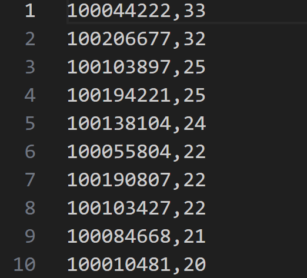
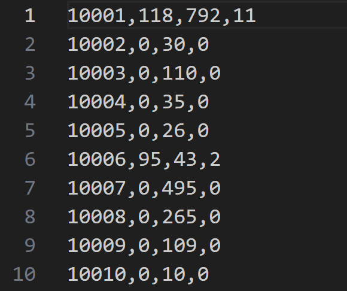
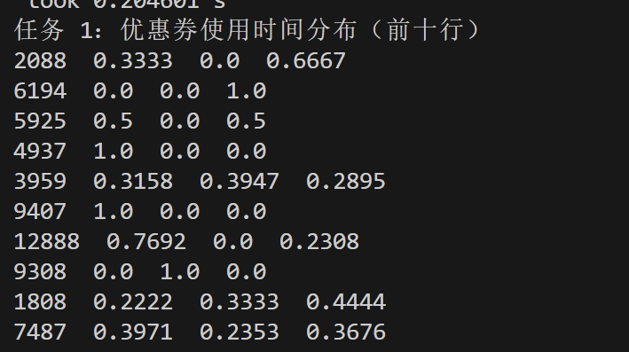
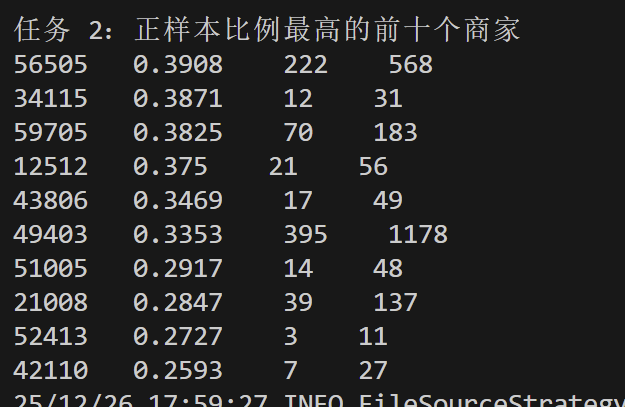
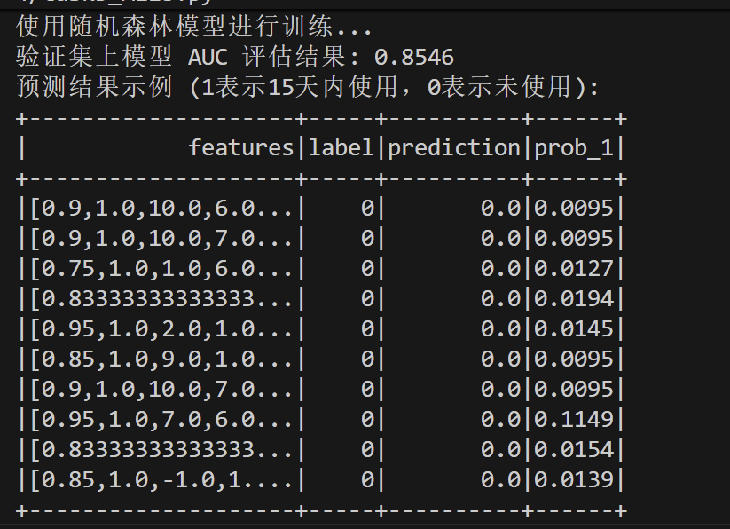
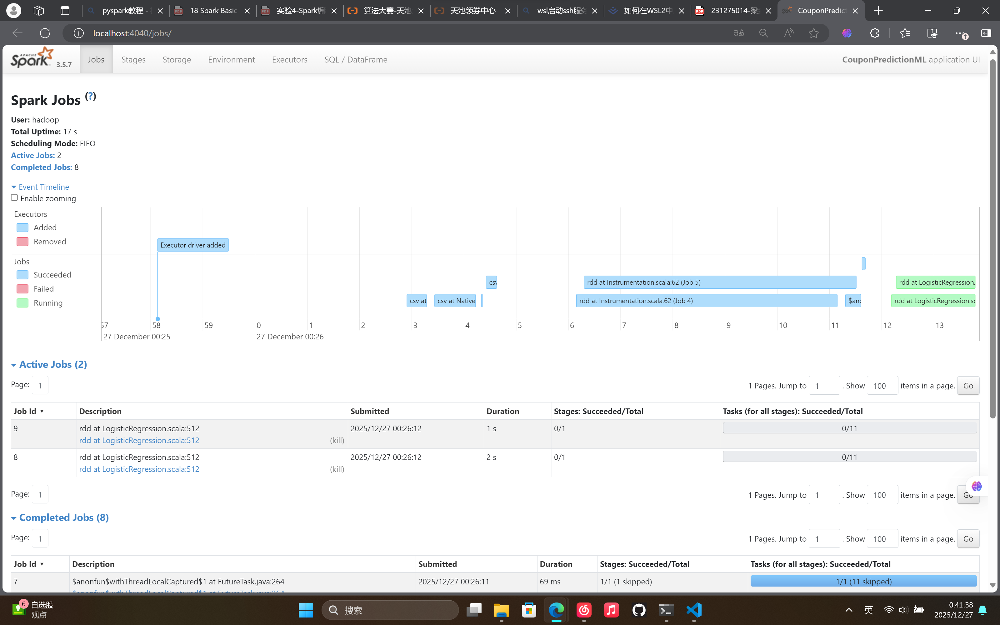
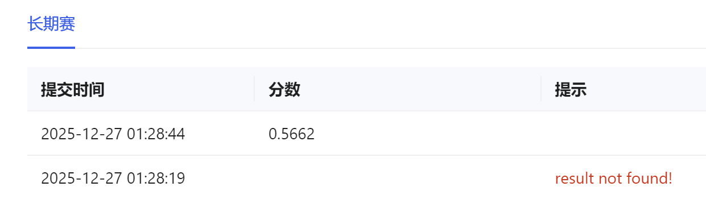

# 实验4：Spark 编程（RDD / Spark SQL / MLlib）实验报告

本仓库为《金融大数据》实验4代码与结果整理，基于天池 O2O 优惠券使用数据集，分别用 **Spark RDD**、**Spark SQL** 和 **Spark MLlib** 完成统计分析与预测任务。

---

## 目录结构

```text
exp04/
├── task1_RDD.py                 # 任务一：RDD 统计
├── task2_SQL.py                 # 任务二：Spark SQL 统计
├── task3_Mlib.py                # 任务三：MLlib 预测
├── dataset/                     # 当前为空
├── result/
│   ├── 1_coupon_use_count/...
│   ├── 1_online_consumption_table/...
│   ├── 2_coupon_time_distribution/...
│   ├── 2_top_merchants/...
│   └── predicted_results/...
└── pics/                        # 报告截图（示例）
```

---

## 环境依赖

- WSL 2 下的 Ubuntu-20.04
- Python 3.13
- Java 11（Spark 运行需要）
- Apache Spark 3.5.7
- PySpark（与 Spark 版本匹配）

如果使用 `spark-submit` 运行脚本，则不需要单独 `pip install pyspark`；如果直接用 `python taskX.py` 跑，需要本地 Python 环境安装 `pyspark`。

---

## 数据集说明

实验使用天池新人实战赛 **O2O 优惠券使用预测** 数据集（与实验2相同）：

- 线上行为：`dataset/ccf_online_stage1_train.csv`
- 线下训练：`dataset/ccf_offline_stage1_train.csv`
- 线下测试：`dataset/ccf_offline_stage1_test_revised.csv`

字段结构（脚本内也有注释）：

- Online：`User_id, Merchant_id, Action, Coupon_id, Discount_rate, Date_received, Date`
- Offline：`User_id, Merchant_id, Coupon_id, Discount_rate, Distance, Date_received, Date`

---

## 任务一：Spark RDD 编程（`task1_RDD.py`）

### 1）设计思路

对线上数据使用 RDD 转换链完成两类统计：

- **优惠券被使用次数统计**：筛选 `Coupon_id != null` 且 `Date != null`，按 `Coupon_id` 计数并降序输出。
- **商家优惠券使用情况统计**：按题目规则将每条记录映射为 `(neg, norm, pos)`，再对 `Merchant_id` 聚合求和并按商家升序。

### 2）核心代码片段

（1）优惠券使用次数统计（RDD 转换链）：

```python
used_coupons = data.filter(lambda x: x[3] != 'null' and x[3] != 'fixed' and x[6] != 'null') \
                   .map(lambda x: (x[3], 1)) \
                   .reduceByKey(lambda a, b: a + b) \
                   .sortBy(lambda x: x[1], ascending=False)
```

（2）商家三分类统计（负样本/普通消费/正样本）：

```python
def classify_consumption(fields):
    merchant_id = fields[1]
    coupon_id = fields[3]
    date = fields[6]

    neg, norm, pos = 0, 0, 0
    if date == 'null' and coupon_id != 'null':
        neg = 1
    elif date != 'null' and coupon_id == 'null':
        norm = 1
    elif date != 'null' and coupon_id != 'null':
        pos = 1
    return (merchant_id, (neg, norm, pos))

merchant_stats = data.map(classify_consumption) \
                     .reduceByKey(lambda a, b: (a[0]+b[0], a[1]+b[1], a[2]+b[2])) \
                     .sortByKey()
```

### 3）运行结果与截图

（1）优惠券 Top10（来自 `result/1_coupon_use_count/part-00000`）：



（2）商家统计前10行（来自 `result/1_online_consumption_table/part-00000`）：



---

## 任务二：Spark SQL 编程（`task2_SQL.py`）

### 1）设计思路

- **任务2.1**：对 `ccf_offline_stage1_train` 中“已用券”的记录，取消费日期的日（day），计算上/中/下旬概率。
- **任务2.2**：读取任务一生成的 `online_consumption_table`，计算正样本比例并排序取 Top10。

### 2）核心 SQL 代码片段

（1）优惠券使用时间分布：

```sql
WITH processed_data AS (
    SELECT 
        Coupon_id,
        CAST(SUBSTRING(CAST(Date AS STRING), 7, 2) AS INT) as day
    FROM offline_table
    WHERE Date != 'null' AND Coupon_id != 'null'
)
SELECT 
    Coupon_id,
    ROUND(SUM(CASE WHEN day <= 10 THEN 1 ELSE 0 END) / COUNT(*), 4) as early_prob,
    ROUND(SUM(CASE WHEN day > 10 AND day <= 20 THEN 1 ELSE 0 END) / COUNT(*), 4) as mid_prob,
    ROUND(SUM(CASE WHEN day > 20 THEN 1 ELSE 0 END) / COUNT(*), 4) as late_prob
FROM processed_data
GROUP BY Coupon_id
```

（2）商家正样本比例 Top10：

```sql
SELECT 
    Merchant_id,
    ROUND(Pos_Count / (Neg_Count + Norm_Count + Pos_Count), 4) as pos_ratio,
    Pos_Count,
    (Neg_Count + Norm_Count + Pos_Count) as total_count
FROM online_table
WHERE (Neg_Count + Norm_Count + Pos_Count) > 0
ORDER BY pos_ratio DESC, Merchant_id ASC
```

### 3）运行结果与截图

（1）分布统计前10行（来自 `result/2_coupon_time_distribution/part-*.csv`）：



（2）Top10 商家（来自 `result/2_top_merchants/part-*.csv`）：



---

## 任务三：Spark MLlib 编程（`task3_Mlib.py`）

### 1）设计思路

- 标签(label)：用户领券后 15 天内使用记为 1，否则为 0。
- 特征：折扣形式/力度、距离、星期/周末，以及训练集统计特征（用户/商家/用户-商家核销率）。
- 模型：随机森林二分类；验证集指标使用 AUC。
- 输出：对 `ccf_offline_stage1_test_revised.csv` 生成核销概率并保存。

### 2）核心代码片段

（1）label 构造：

```python
df = df.withColumn("consume_date", to_date(col("Date").cast("string"), "yyyyMMdd"))
df = df.withColumn("label", when(
    (col("Date") != "null") & (datediff(col("consume_date"), col("received_date")) <= 15), 1
).otherwise(0))
```

（2）特征与向量化：

```python
feature_cols = [
    "rate", "is_manjian", "distance_val", "day_of_week",
    "user_verify_rate", "merchant_verify_rate", "is_weekend",
    "threshold", "discount_amt", "um_verify_rate"
]
assembler = VectorAssembler(inputCols=feature_cols, outputCol="features", handleInvalid="keep")
```

（3）模型训练与 AUC：

```python
rf = RandomForestClassifier(featuresCol="features", labelCol="label", numTrees=150, maxDepth=5)
model = rf.fit(train_data)

predictions = model.transform(test_data)
auc = evaluator.evaluate(predictions)
print(f"验证集上模型 AUC 评估结果: {auc:.4f}")
```

### 3）运行结果与截图

预测结果文件：`result/predicted_results/part-*.csv`

各种不同模型的预测结果：逻辑回归和随机森林的AUC均在0.85左右，决策树的AUC在0.7左右



其他模型的结果在`pics`文件夹中。

spark平台运行状况如下：



提交到天池平台的结果：




## 问题与解决

### 1）spark版本匹配

spark4.0.0与其他组件有版本冲突，提示需要降级；重新安装3.5.7版本后顺利启动。

### 2）天池平台评分低

考虑可能的原因有以下：
- 特征过少
- 数据量不足
- 未作最佳超参数搜索
- 模型能力较弱

对应地，应该扩大数据量（考虑数据集已经给定，可能无法实现）而后提取更多特征，选择更好的模型如GBT等，在有条件的设备上做最佳超参数搜索；或直接引入小参数大模型进行训练/微调。受限于时间与设备，该部分留待未来实现。